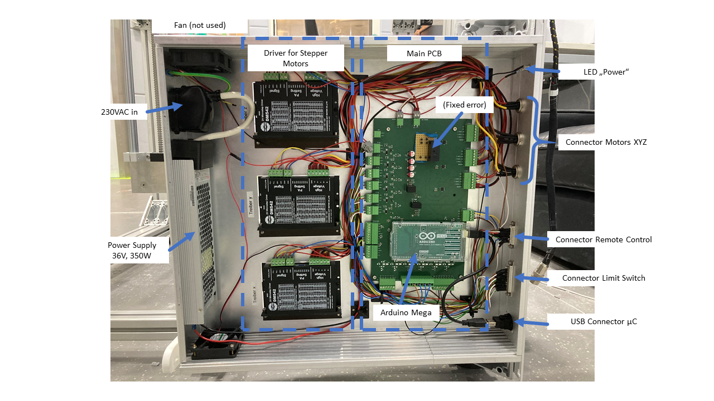

# Hardware

## Assembly Robot

The assembly of the robot, including all CAD design files and instructions, is thoroughly described and documented in the following resources:  
- [COSI Measure Project Page](https://www.opensourceimaging.org/project/cosi-measure/)  
- [COSI Measure GitHub Repository](https://github.com/opensourceimaging/cosi-measure/tree/master/Mechanical%20System)  

We recommend referring to these resources for detailed instructions. The hardware components for the drive and ordering details are also described there.

### Key Components for 3D Drive
We used the following parts for the 3D drive. These may be relevant if adapting the PCB, though similar drives should also work:

- **Motor**: NEMA23 60HS88, 3 pieces (no longer available)  
  Alternative: [HYBRID NEMA-23 Stepper Motor](https://www.reichelt.de/hybridschrittmotor-nema-23-1-8-4-2-a-2-52-v-act-23hs9440-26-p316758.html?&trstct=pos_6&nbc=1)  
- **Motor Driver**: ACT DM542, 3 pieces  
  Link: [Stepper Motor Driver ACT DM542](https://www.reichelt.de/schrittmotortreiber-fuer-nema-23-18-50-v-act-dm542-p237924.html?&trstct=pos_1&nbc=1)  
- **Limit Switch**: LJ12A3-4-Z/BX DC6-36V, 3 pieces  
  Link: [Inductive Sensor](https://www.roboter-bausatz.de/p/induktiver-sensor-lj12a3-4-z-bx-dc6-36v?number=RBS11420)  
- **Power Source**: 36V, 9.75A (350W)  
  Link: [36V Power Supply](https://www.reichelt.de/schaltnetzteil-geschlossen-351-w-36-v-9-75-a-mw-uhp-350-36-p256082.html?&trstct=pol_6&nbc=1)  

---

## Assembly PCB

### General

For this version of COSI Measure, we used an **Arduino Mega** as the central microcontroller (µC).  

While assembling, some errors in the V1.0 PCB design were identified and corrected in version V2.0, which is made available here.  

This design uses a two-part concept:  
1. **Main PCB**  
2. **Optional Remote Control**  
   - The remote control can manually adjust the Hall sensor's position. Although the remote control functionality was disabled in this setup, the buttons and encoders remain available in the hardware. Manual control has been replaced by Python-based software control.

If needed, you can design your own remote control and connect it via the 26-pin SubD connector.

### Implemented Functions

- Control of 3 stepper motors via PWM signals.  
- Safety circuit with emergency stop to disconnect motor drivers' power supply.  
- I2C output, e.g., for display integration.  
- Serial communication (USB) with the host PC.  
- Other analog inputs/outputs are available and can be used e.g. for additional sensors.

### PCB Design
- Designed using **KiCad 8** (no additional packages required).  
- Comments in the schematic provide explanatory details.  
- Uses large SMD components (e.g., SMD1206 for resistors and capacitors) for easy soldering.  
- Two-layer PCB design to reduce manufacturing costs.  
- A bill of materials (BoM) is included in the accompanying Excel sheet.  

#### Note
The PCB size can be reduced by modifying component footprints and minimizing unused connectors.

### Assembly PCB
- Large component sizes simplify soldering.  
- Arduino Mega connects via pin headers for easy replacement.  
- A cutout in the PCB allows visibility of the Arduino's built-in LED when mounted.  

### Wiring Inside the Case
The PCB, power supply, and motor drivers are all housed in a single case. Wiring is straightforward with labeled connectors on the PCB. **Phoenix 3.81mm PCB connectors** were used to facilitate cable attachment.  

#### ⚠️ Important Safety Note:
- The power supply operates at 230V AC, which is **extremely dangerous**.  
- Electrical connections between the power input and power supply are **not documented here**.  
- **Only a qualified electrician** should handle this part. Ensure the case is grounded and use an FI-protected socket.

---

## Assembly Case for Electronics

### Case Design
The case is a standard **19-inch, 2 height units** enclosure. The side profiles, front and back panels, and top and bottom panels were milled using a mechanical workshop.  

For best results, the front and back panels should be milled. Alternatively, mounting holes can be created manually. Accuracy is essential for mounting the DSub connector.  

Cooling: Two 12V fans were installed but found unnecessary during operation. Drivers were mounted on the base plate with cooling fins extending outward for heat dissipation. However, this may not be required.

### CAD Files
The case design was created using **Autodesk Inventor 2022**.  
- Files are exported as STEP files for compatibility with other CAD programs.  
- Side profiles are customizable, depending on the electronics installed.  

### Front Connections
All parts for the front panel are listed in the BoM.  
- **USB**: For Arduino Mega-PC serial communication.  
- **Limit Switches**: 25-pin Sub-D (male) for connecting up to 6 limit switches.  
- **Remote Control**: 26-pin Sub-D (female).  
- **Motor Connections**: 4-pin DIN connectors (male) for X, Y, and Z-axis motors.  
- **Power LED**: Indicates power supply status.  
- **Emergency Stop**: Cuts power to motor drivers via relay.  

### Back Connections
- **230V IEC Plug**: Includes an on/off switch and main fuse (1.75A, slow-blow).  

### Wiring
Wiring is simplified by labeled PCB connectors and depends on the components installed. For questions, please contact us.

---
