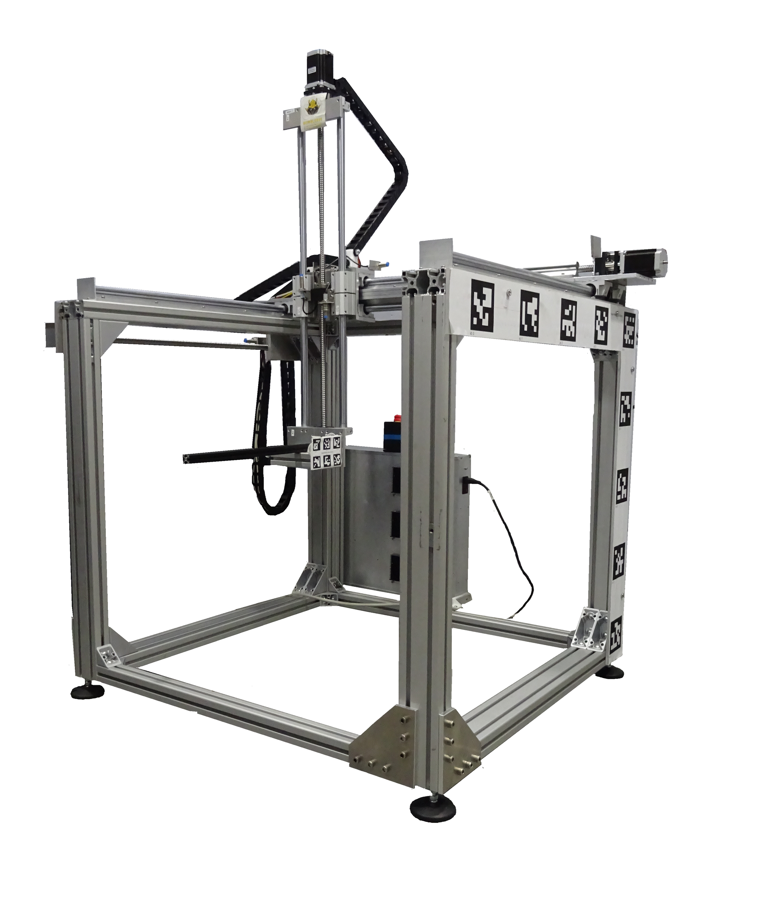

# Bumblebee 3-Axis Measurement System

  

## Overview

The **Bumblebee 3-Axis Measurement System** is a versatile, open-source, cubic positioning robot adapted for low-field MRI research. This project builds upon the design of the original [COSI Measure Robot](https://www.opensourceimaging.org/project/cosi-measure/), enhancing its mechanical and electronic capabilities. The system was redesigned during the 2023-2024 academic year as part of several bachelor theses at our institute.

### Key Features
- **Adapted Mechanical Design**  
  The robot is designed for:
  - A larger measurement volume.
  - Improved efficiency relative to the robot's size.

- **Simplified Electronics**  
  Replacing the BeagleBone Black and embedded Linux system, the new design features:
  - An **Arduino MEGA** as the central microcontroller for motor control, limit switch evaluation, and serial communication.
  - A **Python-based host PC script** to:
    - Control mapping.
    - Communicate positions to the robot.
    - Interface with the Hall sensor.

- **Sensor Integration**  
  The current setup uses the **F.W. BELL Series 9900 Hall sensor** with the ZOA99-3208 3D Hall probe. The Python script processes data from this sensor via serial communication. However, the system can accommodate other sensors as needed.

---

## Publication

This work was presented and published as a conference paper:  
**Samlow J, Maltsev S , Buckenmaier K, Scheffler K, Povolni P (2024). Easy Rebuildable Cubic 3-Axis Positioning Robot Based on Open-Source Hardware: Validated via Camera-Based Motion Tracking and Initial Application in Magnetic Low Field Mapping.** *DACH-ISMRM 2024 Program & Proceedings, Tübingen, Germany*, pp. 1–2.

---

## Getting Started

There a tree major parts:

### System Components
1. **Hardware** [here](Hardware)
   - Rebuilt mechanical design for larger volume mapping.
   - Compact yet efficient cubic robot frame.

2. **Electronics** 
   - Arduino MEGA for robot control and interfacing [here](Software/Arduino/).
   - Support for various sensors through serial communication.

3. **Software** [here](Software/Python GUI/)
   - Python script to manage mapping and communication.

### Usage
1. Set up the Arduino MEGA and connect the motors, limit switches, and Hall sensor.
2. Run the Python script on the host PC for:
   - Position control of the robot.
   - Real-time data collection from the Hall sensor.

---

### Contact
For further inquiries or contributions, feel free to reach out through the repository. 

