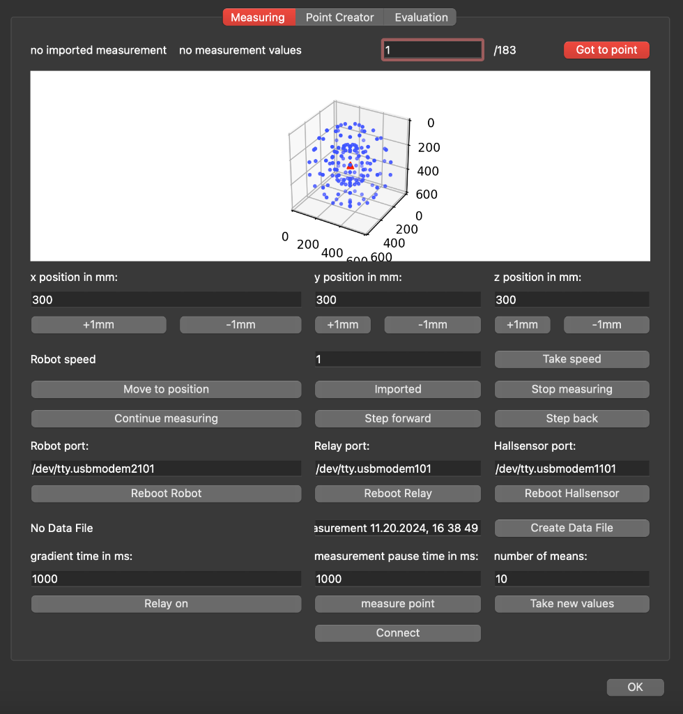
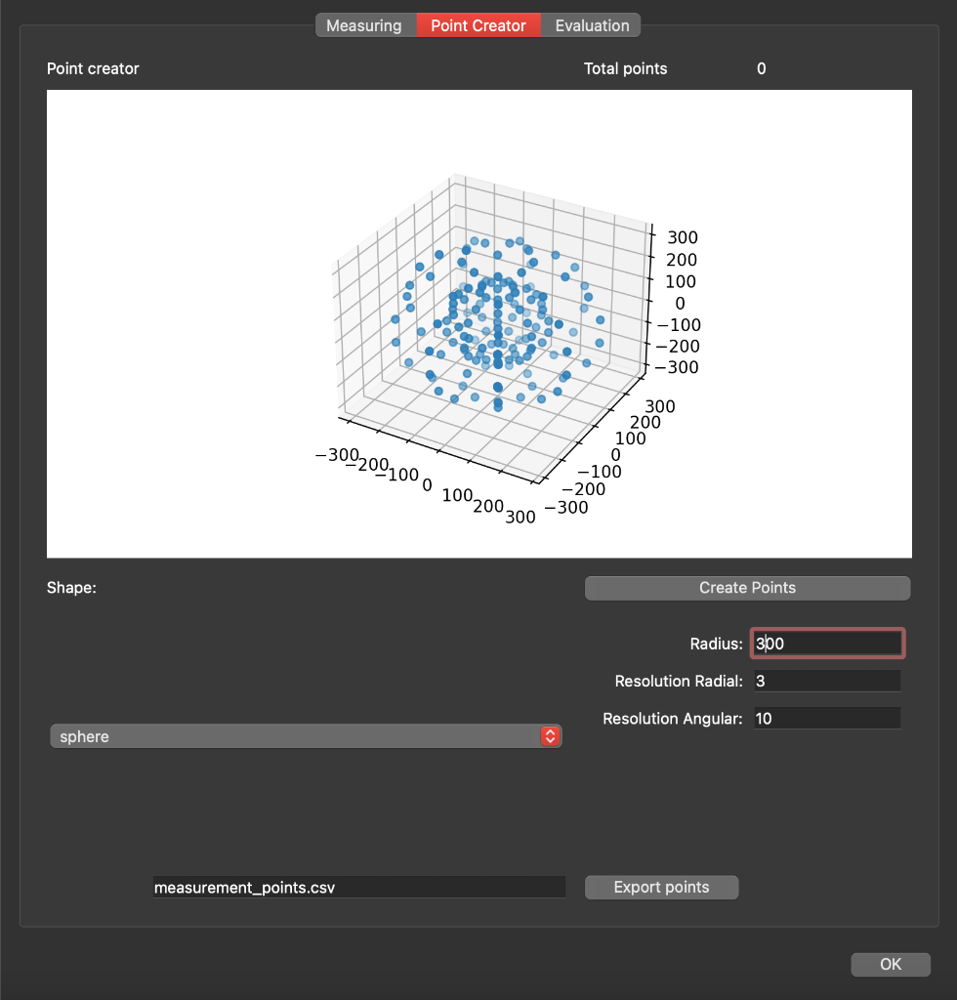
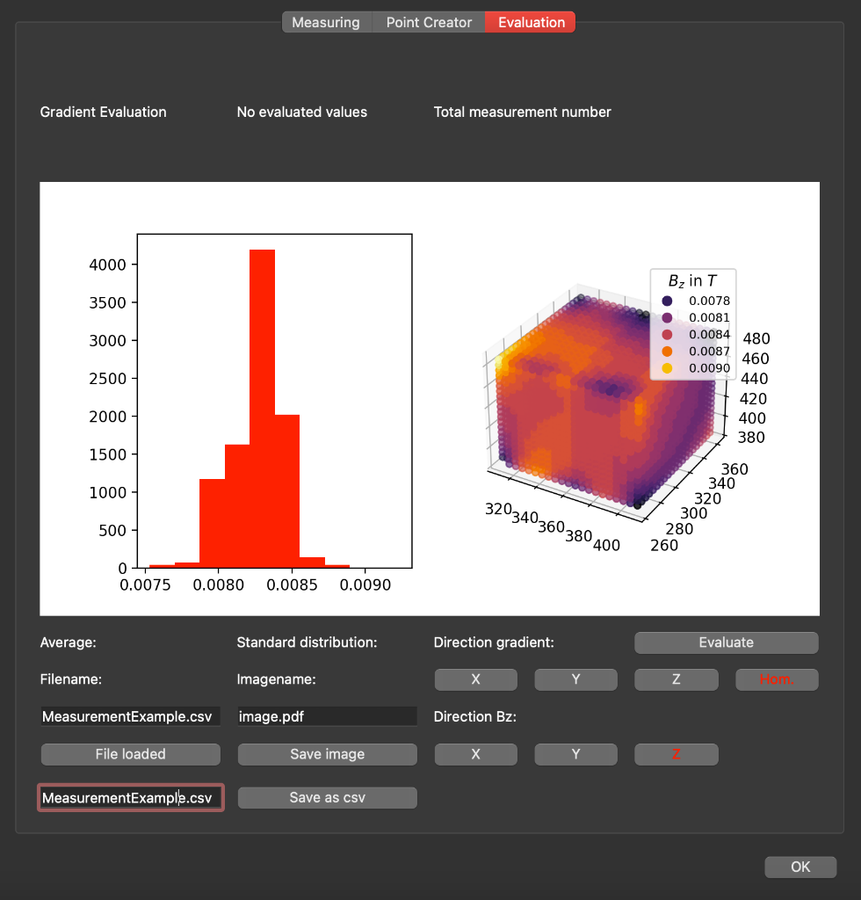

# Python GUI Software

## Overview

This script opens a GUI to operate the **3-Axis Measurement System**, create a measurement point structure, and evaluate a measured magnetic field.

### Key Features
- **Adapted Program Design**  
  This Program is designed for:
  - Movement of the Robot, by a Serial connection.
  - Creation of a point array for different shapes.
  - Automatic measurement of the points array with also saves the Hall sensor data.
  - An optional activation of a Relay during the measurement, e.g. to measure a current dependent system.
  - Evaluation of a measurement with plot a histogram of the gradient magnetic field or a homogeneous field.

- **Tab Design**  
  The Tabs in this Program are designed like:
  - **Measurement Tab**: This Tab controls the robot, relay and Hall sensor by 3 different Serial connections:  
      
  - **Point Creator Tab**: This Tab creates a Measurement CSV file, which can be implemented into the Measurement Tab, to start a measurement through it:  
      
  - **Evaluation Tab**: In this Tab you can make a simple evaluation:  
      

## Get Started

You need Python **3.8** or newer. Follow these steps to set up and run the software:

### 1. Create a Virtual Environment (Recommended)

1. Open your terminal or command prompt.
2. Navigate to the project directory:
   ```bash
   cd path/to/project

3. Create a virtual environment:
  '''bash
  python3 -m venv myenv

4. Activate the virtual environment:
 - On macOS/Linux:
    '''bash
    source myenv/bin/activate

- On Windows:
    '''bash
    myenv\Scripts\activate

5. Once activated, install the required libraries:
  '''bash
  source myenv/bin/activate

### 2. Run the Software
1. Start the program with the following command:
  '''bash
  python ALFRobotSoftware.py

2. The GUI will open, and you can begin using the application.

### Contact
For further inquiries or contributions, feel free to reach out through the repository. 
